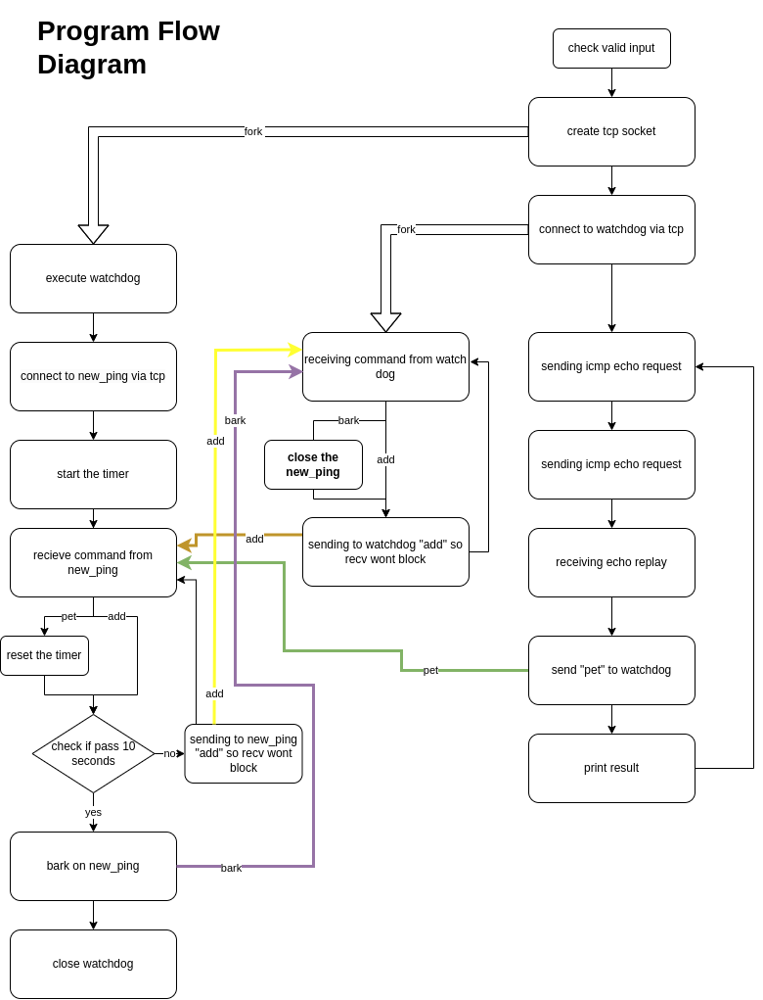

# Network 4 assignment

The program PartA use to make simple ping to desire ip destination.
The program PartB add on top of that the element of watch dog if the program won't get replay (pong) after 10 seconds the watchdog will close the program


## Pre-installation

Necessary packages to run the program

```bash
sudo apt-get install make
sudo apt-get install git
sudo apt-get install gcc
```
## Installation

first, get the project by typing in the terminal, and compile
```bash
https://github.com/eytan1998/Network_4.git
cd Network_4
make all
```
# How to use
IP - desire ip, ip not specify the default is 8.8.8.8
To run the ping without the watchdog
```bash
  sudo ./PartA IP
```
To run with watchdog
```bash
  sudo ./PartB IP
```
all left is to enjoy the ping pong.

# Program flow diagram

